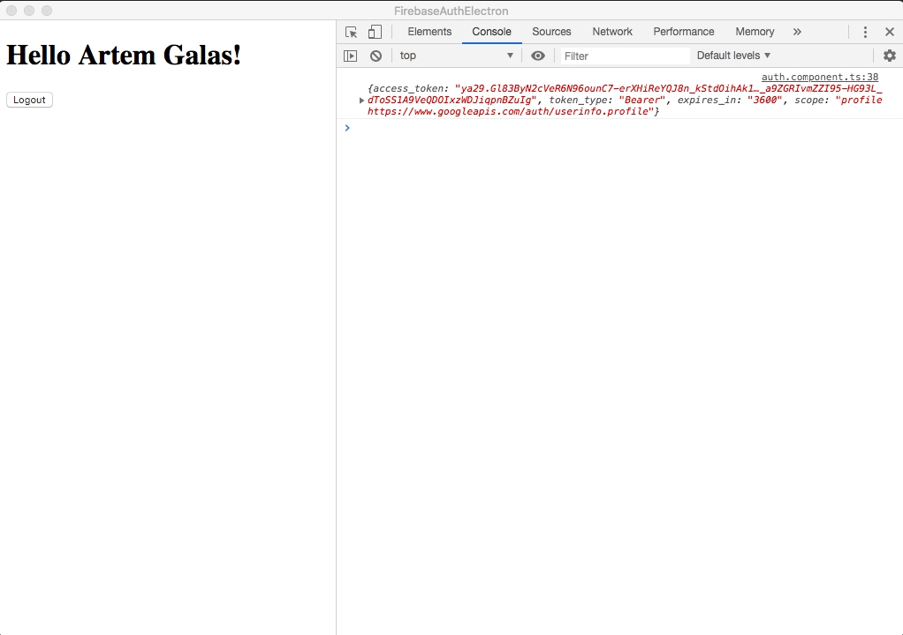

# Angular + Electron + Firebase GoogleAuth



Simple project that represent how to integrate FirebaseAuth to Electron App.

Since Firebase Auth does not supported electron apps we have to do it manually.
This project use two helper packages: 
- [electron-oauth-helper](https://github.com/mironal/electron-oauth-helper) - do all manual work under the hud (open necessary window, got response)
- [ngx-electron](https://github.com/ThorstenHans/ngx-electron) - communicate between Electron Main process and Angular (Electron Renderer process)

## How to use
First of all you have to setup firebase auth - [firebase console](https://console.firebase.google.com)

Open your `environment.ts` and put firebase config there.

Then you have to: 
- go to [google developer console](https://console.developers.google.com/apis)
- find project with *the same name* as you already created on firebase
- open `Identity Toolkit API` 
- go to `Credentials` tab (on the left-side menu)
- Find table with title `OAuth 2.0 Client IDs` and open item with name `Web client (auto created by Google Service)`
- copy: 
    - `Client ID` it looks something like `someKey.apps.googleusercontent.com`
    - `Client secret`
    - Authorized redirect URIs one of them `https://${fireBaseIndentificator}.firebaseapp.com/__/auth/handler` or `https://${fireBaseIndentificator}.web.app/__/auth/handler`
- paste these variables to `electon/main.js`:

```javascript
const config = {
    client_id: 'YOUR_CLIENT_ID.apps.googleusercontent.com',
    client_secret: 'YOUR_SECRET',
    redirect_uri: 'YOUR_REDIRECT_URI',
    authorize_url: 'https://accounts.google.com/o/oauth2/v2/auth',
    response_type: "token",
    scope: "https://www.googleapis.com/auth/userinfo.profile",
  };
```

1. Install dependencies in angular project and in electron folder
```bash
npm install
cd electron && npm install
```
2. Build Angular app into electron folder
```bash
npm run build-electron
```
3. Run electron application
```bash
npm run start-electron
```

## How it works

In our `auth.component.ts` we have a button `Login`. 
Inside component code we detect if it electron app, and *send* message to `IpcRenderer` (to Electron).

Into `electron/main.js` file we detect this message and create a new window where we ask permission for user. 
Then that window *reply* with a message to our Angular Auth component. 
Where we just parse parameters and then login user with credential (`this.angularFireAuth.auth.signInWithCredential(credential);`)  

## Knowing issues
1. Your angular app should compiled to `es5` *NOT* to `es2015`. For change this open `tsconfig.json` and change target to `es5` that issue related to Electron (basically for Chromium what is use)
2. Electron complains warning in console. 
```
Electron Security Warning (Insecure Content-Security-Policy)
...
```
